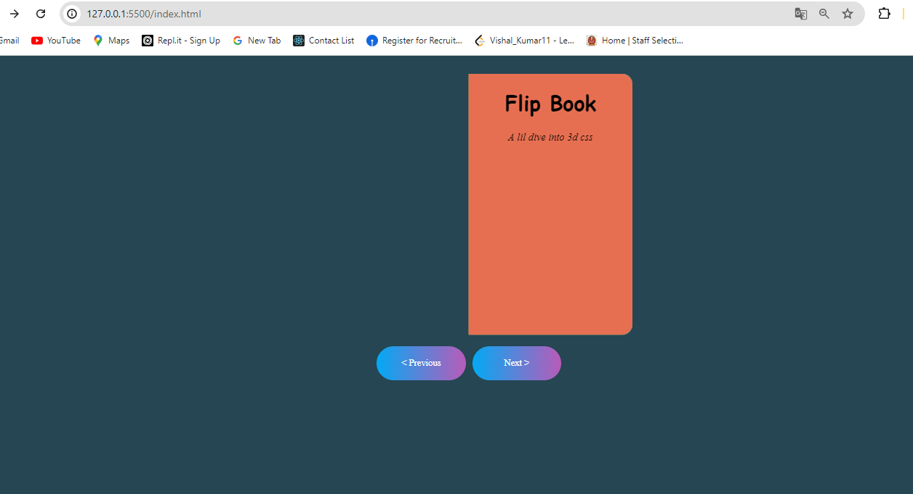
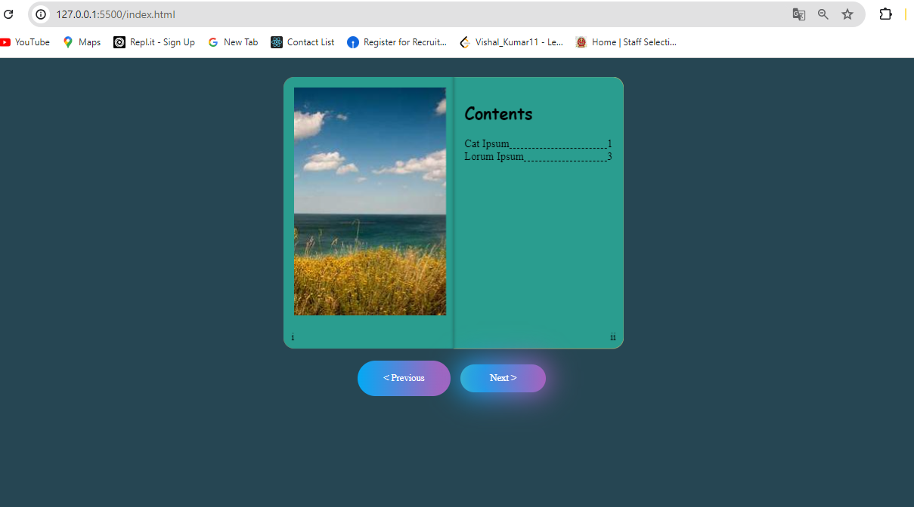
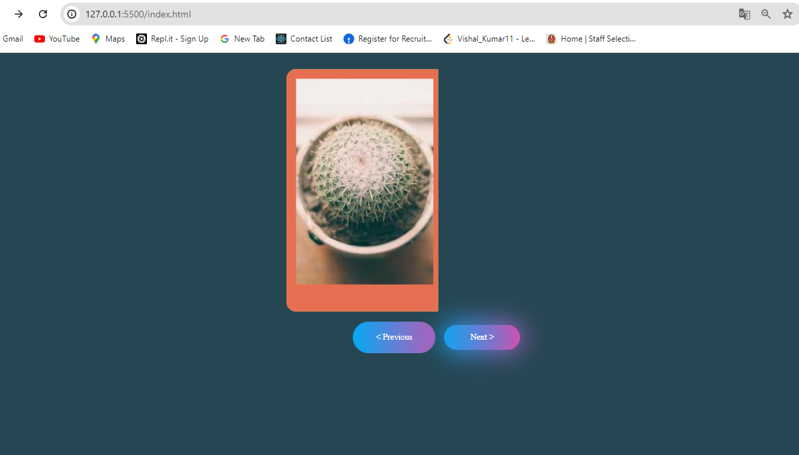

# 3D CSS Flip Book

This project showcases a 3D flipbook using HTML, CSS, and JavaScript. The flipbook simulates the experience of flipping through pages of a book, with each page featuring unique content and styling.

## Getting Started

### Prerequisites

- A modern web browser that supports 3D CSS transformations and JavaScript.

### Running the Flip Book

1. Save the `index.html`, `style.css`, and `script.js` files to your local machine.
2. Open the `index.html` file in your web browser.

## Features

- 3D page flip animation for a realistic book-reading experience.
- Navigation buttons to flip pages forward and backward.
- Each page can have unique content and background colors.

## HTML Structure

- The HTML file contains a `div` with the class `flipbook` that holds the book pages.
- Each page is structured within `div` elements with classes `leaf`, `front`, and `back`.
- Navigation buttons (`Previous` and `Next`) allow users to navigate through the pages.

## CSS Styling

- The `style.css` file includes styles for the 3D effect, layout, and design of the book.
- Background colors and styles for individual pages are defined inline within the HTML for demonstration purposes.

## JavaScript Functionality

- The `script.js` file contains the `FlipBook` class that manages the page flipping logic.
- The class initializes with references to the book element, pages, and navigation buttons.
- The `turnPage` method handles the 3D transformation of pages to create the flipping effect.
- Event listeners are set up to handle button clicks for navigation.

## How to Use

1. Open the `index.html` file in your web browser.
2. Use the `Next` and `Previous` buttons to navigate through the pages.
3. Observe the 3D flipping animation as you navigate.

## Notes

- Ensure the `style.css` and `script.js` files are located in the same directory as the `index.html` file for proper functionality and styling.
- The example uses placeholder images from `picsum.photos` for demonstration purposes.

Enjoy exploring the 3D CSS Flip Book!

### Out Put Screen

#### First Page

#### Index Page

#### Last Page
